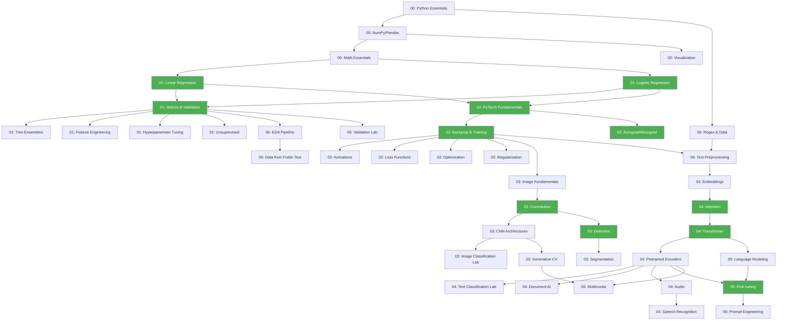

# 📦 Nội Dung Giáo Trình — Cấu Trúc Module & Chapters

> [← Quay lại Tổng Quan](00_tong_quan.md)

---

## Nguồn Thiết Kế Nội Dung

Nội dung module được thiết kế dựa trên:

1. **Đề cương ôn luyện OlpAI** (Cẩm nang Phần 15) — 3 nhóm: ML/DL + CV + NLP/Audio
2. **Lộ trình 5 chặng** (Cẩm nang Phần 04) — thứ tự học
3. **Lộ trình 8 module** (Cẩm nang Phần 18) — M0→M7 của Meta Ecom Uni × PTIT
4. **IOAI 2026 Syllabus** — chuẩn quốc tế
5. **OlimpiadaAI/szkolenia** (Ba Lan) — repo giáo trình tham khảo

---

## Tổng Quan Modules

| # | Module | Ánh xạ Cẩm nang | Ánh xạ 5 Chặng | Số chapters |
|---|--------|-----------------|-----------------|-------------|
| 00 | **Python & Toán Nền Tảng** | Phần 15: Lập trình + Toán | Chặng 1 | 5 |
| 01 | **Machine Learning** | Phần 15: Học có/không giám sát + Đánh giá + Khoa học dữ liệu | Chặng 2 | 8 |
| 02 | **Deep Learning** | Phần 15: Mạng nơ ron + Kiến trúc + Tối ưu + Chính quy | Chặng 3 | 7 |
| 03 | **Computer Vision** | Phần 15: Thị giác máy tính (toàn bộ) | Chặng 3-4 | 8 |
| 04 | **NLP & Audio** | Phần 15: NLP + Audio (toàn bộ) | Chặng 3-4 | 9 |
| 05 | **Generative AI & LLM** | Phần 15: Fine-tuning + Prompt | Chặng 4 | 4 |
| 06 | **Competition Pipeline** | Phần 11-12: Chuẩn bị + Chiến thuật thi | Chặng 5 | 7 |
| 07 | **Olympiad Problems** | Phần 17: Đề thật | Chặng 5 | ongoing |
| 08 | **Team Competition** | Phần 10: Nộp bài + FINAL | Chặng 5 | 5 |

---

## Module 00: Python & Toán Nền Tảng

> Cẩm nang Chặng 1: "Xây dựng nền móng"
> Đề cương: "Python cơ bản, NumPy, Pandas, Matplotlib, Seaborn"

| Chapter | Loại | Nội dung | Track |
|---------|------|----------|-------|
| `python_essentials/` | [Concept] | Cấu trúc điều khiển, hàm, lớp, xử lý ngoại lệ, file I/O | F: ⭐ C: ⏭️ |
| `numpy_pandas/` | [Concept] | NumPy arrays, broadcasting, Pandas DataFrame, merge, groupby | F: ⭐ C: 📖 |
| `regex_data_handling/` | [Concept] | **Regex** (re module), đọc CSV/JSON, web scraping cơ bản, pathlib, glob, os | F: ⭐ C: ⭐ |
| `math_essentials/` | [Concept] | Đại số tuyến tính, đạo hàm, xác suất thống kê — cheat sheet thực dụng | F: ⭐ C: 📖 |
| `visualization/` | [Concept] | Matplotlib, Seaborn, Plotly — EDA plots | F: ⭐ C: ⏭️ |

### Kiến thức bổ sung (thiếu trong plan cũ):
- **`regex_data_handling/`**: Regex là kỹ năng thiết yếu cho tiền xử lý text, parse file, extract patterns. Module `re` nằm trong danh sách thư viện cho phép (Cẩm nang Phần 08). Bao gồm cả `os`, `glob`, `pathlib`, `json`, `csv`, `pickle` — tất cả đều trong danh sách được phép.

---

## Module 01: Machine Learning

> Cẩm nang Chặng 2: "Hiểu về cách máy tính học"
> Đề cương: Học có giám sát + Kết hợp mô hình + Học không giám sát + Đánh giá + Khoa học dữ liệu

| Chapter | Loại | Nội dung | Track |
|---------|------|----------|-------|
| `linear_regression/` | [Core] | Hồi quy tuyến tính, gradient descent, L1/L2 regularization | F: ⭐ C: 📖 |
| `logistic_regression/` | [Core] | Hồi quy logistic, cross-entropy, decision boundary | F: ⭐ C: 📖 |
| `metrics_and_validation/` | [Core] | Accuracy, Precision, Recall, F1, ROC/AUC, ma trận nhầm lẫn, chọn ngưỡng, k-fold, train/val/test split | F: ⭐ C: ⭐ |
| `tree_ensembles/` | [Concept] | Decision Tree, Random Forest, XGBoost, LightGBM, CatBoost | F: ⭐ C: ⭐ |
| `svm_knn/` | [Concept] | SVM, KNN — khi nào dùng, khi nào không | F: 📖 C: ⏭️ |
| `unsupervised/` | [Concept] | K-Means, PCA, t-SNE, UMAP, DBSCAN, phân cụm phân cấp | F: 📖 C: 📖 |
| `feature_engineering/` | [Concept] | Encoding, scaling, feature selection, xử lý missing/outlier/imbalance, leakage | F: ⭐ C: ⭐ |
| `hyperparameter_tuning/` | [Concept] | Grid/Random/Bayesian search, cross-validation pipeline, sklearn pipeline | F: 📖 C: ⭐ |

### Thay đổi so với plan cũ:
- Thêm **XGBoost, LightGBM, CatBoost** — đề cương liệt kê rõ ràng
- Thêm **chọn ngưỡng dự đoán** — đề cương yêu cầu
- Thêm **hyperparameter tuning** — đề cương mục "Khoa học dữ liệu"
- Tách **SVM + KNN** riêng (đề cương liệt kê cả hai)
- Thêm **DBSCAN, phân cụm phân cấp, phổ** — đề cương yêu cầu

---

## Module 02: Deep Learning

> Cẩm nang Chặng 3: "Đi sâu vào mạng thần kinh"
> Đề cương: Mạng nơ ron + Hàm mất mát + Kiến trúc + Tối ưu + Chính quy + Fine-tuning

| Chapter | Loại | Nội dung | Track |
|---------|------|----------|-------|
| `pytorch_fundamentals/` | [Core] | Tensor, autograd, Dataset, DataLoader, GPU/CPU, training/inference loop | F: ⭐ C: ⭐ |
| `autograd_micrograd/` | [Core] | Scalar autograd engine from scratch (Karpathy-style) | F: ⭐ C: 📖 |
| `backprop_training_loop/` | [Core] | Manual backprop, gradient descent, training loop from scratch | F: ⭐ C: 📖 |
| `activation_functions/` | [Concept] | ReLU, Sigmoid, Tanh, GELU — khi nào dùng cái nào | F: ⭐ C: ⏭️ |
| `loss_functions/` | [Concept] | MSE, MAE, Cross-Entropy, Focal Loss — matching loss to task | F: ⭐ C: 📖 |
| `optimization/` | [Concept] | SGD, Momentum, Adam, AdamW, Mini-batch GD, LR schedulers | F: ⭐ C: 📖 |
| `regularization/` | [Concept] | Dropout, Early Stopping, Weight Decay, Weight Init, BatchNorm, underfitting/overfitting, bias-variance | F: ⭐ C: 📖 |

### Thay đổi so với plan cũ:
- Thêm **`pytorch_fundamentals/`** — đề cương yêu cầu cụ thể Tensor + CPU/GPU
- Thêm **`loss_functions/`** riêng — đề cương có mục riêng "Hàm mất mát"
- Thêm **`activation_functions/`** riêng — đề cương liệt kê ReLU, Sigmoid, Tanh
- Thêm **Weight Init** vào regularization — đề cương yêu cầu "khởi tạo trọng số"

---

## Module 03: Computer Vision

> Đề cương: "Thị giác máy tính" — 10 mảng kiến thức

| Chapter | Loại | Nội dung | Đề cương | Track |
|---------|------|----------|----------|-------|
| `image_fundamentals/` | [Concept] | Biểu diễn ảnh, không gian màu, chuẩn hoá, resize | Nền tảng xử lý ảnh | F: ⭐ C: ⏭️ |
| `augmentation/` | [Concept] | Tăng cường dữ liệu ảnh, torchvision transforms | Nền tảng xử lý ảnh | F: ⭐ C: 📖 |
| `convolution/` | [Core] | Conv2d from scratch, kernel, stride, padding, receptive field | Mạng tích chập | F: ⭐ C: 📖 |
| `cnn_architectures/` | [Concept] | LeNet → VGG → ResNet → EfficientNet, pre-trained encoders | Mã hoá ảnh tiền huấn luyện | F: ⭐ C: ⭐ |
| `image_classification/` | [Competition] | Transfer learning, fine-tuning mô hình thị giác | Phân loại ảnh | F: ⭐ C: ⭐ |
| `detection/` | [Core] | IoU, NMS, AP/mAP from scratch + YOLO, SSD, DETR overview | Phát hiện đối tượng + Đánh giá | F: ⭐ C: ⭐ |
| `segmentation/` | [Concept] | Semantic/Instance seg, U-Net, Dice, mIoU, hậu xử lý mask | Phân đoạn ảnh | F: 📖 C: ⭐ |
| `generative_cv/` | [Concept] | GAN basics, Diffusion Models overview, self-supervised (CLIP, SimCLR) | Mô hình sinh + Tự giám sát | F: ⚡ C: 📖 |

### Thay đổi so với plan cũ:
- Thêm **`image_fundamentals/`** — đề cương: "Biểu diễn ảnh, không gian màu"
- Thêm **`generative_cv/`** — đề cương: "GAN, Diffusion Models, Self-supervised, CLIP"
- Thêm **video processing** mention — đề cương: "chuỗi khung hình, nhận dạng hành động"
- Gộp ViT vào `cnn_architectures/` (vision encoders)

---

## Module 04: NLP & Audio

> Đề cương: "Xử lý ngôn ngữ tự nhiên" — 15 mảng kiến thức (bao gồm Audio)

| Chapter | Loại | Nội dung | Đề cương | Track |
|---------|------|----------|----------|-------|
| `text_preprocessing/` | [Concept] | Làm sạch, tokenization, vocabulary, padding, biểu diễn | Tiền xử lý ngôn ngữ | F: ⭐ C: 📖 |
| `embeddings/` | [Concept] | Word2Vec, GloVe, dense embeddings, cosine similarity | Biểu diễn văn bản | F: ⭐ C: 📖 |
| `text_classification/` | [Competition] | Embedding + classifier, fine-tune BERT, evaluation | Phân loại văn bản | F: ⭐ C: ⭐ |
| `attention/` | [Core] | Self-attention, multi-head attention from scratch | Attention Mechanism | F: ⭐ C: ⭐ |
| `transformer/` | [Core] | Encoder/Decoder, positional encoding from scratch | Transformer + Seq2Seq | F: ⭐ C: ⭐ |
| `pretrained_encoders/` | [Concept] | BERT và biến thể, sentence-transformers, HuggingFace usage | Mô hình mã hoá | F: ⭐ C: ⭐ |
| `document_ai/` | [Concept] | OCR, bố cục, bảng, hiểu tài liệu từ ảnh, sinh văn bản có cấu trúc | Document AI + NLP đa phương thức | F: ⚡ C: ⭐ |
| `audio_fundamentals/` | [Concept] | Waveform, sampling rate, spectrogram, tiền xử lý âm thanh, HuBERT | Audio tiền huấn luyện | F: ⚡ C: 📖 |
| `speech_recognition/` | [Concept] | ASR, Whisper, Qwen Audio, fine-tuning audio, WER/CER | Nhận dạng tiếng nói | F: ⚡ C: 📖 |

### Thay đổi so với plan cũ:
- **THÊM MỚI `document_ai/`** — đề cương có hẳn mục "Document AI": OCR, bố cục, bảng
- **THÊM MỚI `audio_fundamentals/`** — đề cương có 5 mục Audio riêng
- **THÊM MỚI `speech_recognition/`** — đề cương: Whisper, Qwen Audio, WER
- Thêm **`pretrained_encoders/`** — đề cương: "BERT và biến thể"
- Bỏ `rag_anatomy/` (không có trong đề cương)

---

## Module 05: Generative AI & LLM

> Cẩm nang Chặng 4: "Tiếp cận Generative AI và LLMs"
> Đề cương: Fine-tuning toàn phần + tiết kiệm tham số + Language Modeling

| Chapter | Loại | Nội dung | Track |
|---------|------|----------|-------|
| `language_modeling/` | [Concept] | LM basics, autoregressive vs masked, perplexity | F: ⚡ C: 📖 |
| `finetuning_patterns/` | [Core] | Full fine-tuning vs LoRA/QLoRA/PEFT, when to freeze | F: ⚡ C: ⭐ |
| `prompt_engineering/` | [Concept] | Prompting strategies, in-context learning, chiến thuật dùng LLM trong thi (2000 tokens!) | F: 📖 C: ⭐ |
| `multimodal/` | [Concept] | Vision-Language Models, text+image tasks | F: ⚡ C: 📖 |

### Hoàn toàn mới so với plan cũ:
- Plan cũ thiếu module Generative AI/LLM
- Cẩm nang dành hẳn M6 cho "Dùng LLM như trợ lý" và cho phép dùng LLM trong thi
- **`prompt_engineering/`** đặc biệt quan trọng: LLM giới hạn 2000 tokens/phiên → cần chiến thuật

---

## Module 06: Competition Pipeline

> Cẩm nang Phần 11-12: Chuẩn bị + Chiến thuật thi
> **ACTIVE TỪ TUẦN 1**

| Chapter | Loại | Nội dung | Track |
|---------|------|----------|-------|
| `eda/` | [Competition] | EDA checklist, visualization, data profiling | F: ⭐ C: ⭐ |
| `validation/` | [Competition] | K-fold, stratified, leakage detection, proper splitting | F: ⭐ C: ⭐ |
| `data_from_public_test/` | [Concept] | **Lấy data từ public test dataset**, pseudo labeling, test-time augmentation | F: 📖 C: ⭐ |
| `debugging_ml/` | [Competition] | Common failure modes, gradient checking, loss debugging | F: ⭐ C: ⭐ |
| `ensembling/` | [Competition] | Stacking, blending, model averaging, khi nào nộp ensemble | F: 📖 C: ⭐ |
| `jupyterlab_workflow/` | [Concept] | JupyterLab thao tác, kernel management, terminal, GPU monitoring | F: ⭐ C: ⭐ |
| `experiment_tracking/` | [Concept] | Logging experiments, seed fixing, reproducibility | F: 📖 C: ⭐ |

### Thay đổi so với plan cũ:
- **THÊM MỚI `data_from_public_test/`** — kỹ thuật tận dụng public test: pseudo labeling, TTA
- **THÊM MỚI `jupyterlab_workflow/`** — Cẩm nang Phần 11 nhấn mạnh "làm quen JupyterLab trước thi"
- Thêm **reproducibility** riêng — Cẩm nang Phần 08: "cố định seed", "chạy tuần tự từ đầu đến cuối"

---

## Module 07: Olympiad Problems

| Chapter | Nội dung |
|---------|----------|
| `diagnostic/` | Diagnostic test cho Contest Track (2-3 bài baseline) |
| `ioai_2024/` | Đề IOAI 2024 + giải + postmortem |
| `ioai_2025/` | Đề IOAI 2025 + giải + postmortem |
| `ioai_2026/` | Đề IOAI 2026 At-Home + giải + postmortem |
| `olpai_vietnam/` | Đề OlpAI Sinh viên + Olympic AI PTIT |
| `poland_oai/` | Đề OlimpiadaAI Ba Lan |
| `aichallenge_ptit/` | Bài từ aichallenge.ptit.edu.vn |
| `mock_contests/` | Mock contest sát format OlpAI |
| `problem_index.md` | Index theo concept → problem |

### Thay đổi:
- **THÊM MỚI `aichallenge_ptit/`** — Cẩm nang Phần 11+17 khuyến nghị luyện trên aichallenge.ptit.edu.vn
- Tách rõ **OlpAI SV** và **Olympic AI PTIT**

---

## Module 08: Team Competition

> Cẩm nang Phần 10: Nộp bài + FINAL structure

| File | Nội dung |
|------|----------|
| `team_roles.md` | Phân vai trong đội 2-3 người |
| `workflow_4h_6h.md` | Chia workload trong 4h (sơ loại) / 6h (chung kết) |
| `technical_report_template.md` | Template báo cáo kỹ thuật |
| `notebook_checklist.md` | Checklist: `generate_result.ipynb` chạy Restart & Run All |
| `final_folder_template.md` | Cấu trúc `/FINAL/TACVU1/`, `/FINAL/TACVU2/` theo đúng quy định |

### Thay đổi:
- Thêm **`final_folder_template.md`** — Cẩm nang Phần 10 quy định rõ cấu trúc FINAL
- Sửa **`workflow_4h_6h.md`** — Vòng sơ loại 4h, chung kết 6h

---

## Templates & Shared

```
templates/
├── tabular_classification.ipynb
├── image_classification.ipynb
├── detection.ipynb
├── segmentation.ipynb
├── text_classification.ipynb
├── audio_classification.ipynb    # MỚI
├── retrieval.ipynb
├── training_loop.py
└── submission_template.py        # MỚI: sinh file nộp đúng format

_dev/
├── authoring_checklist.md
├── review_log.md
└── learner_test_log.md
```

---

## Curriculum Map (Dependency Graph)



<small>🟢 = Core Chapter (from-scratch bắt buộc)</small>
