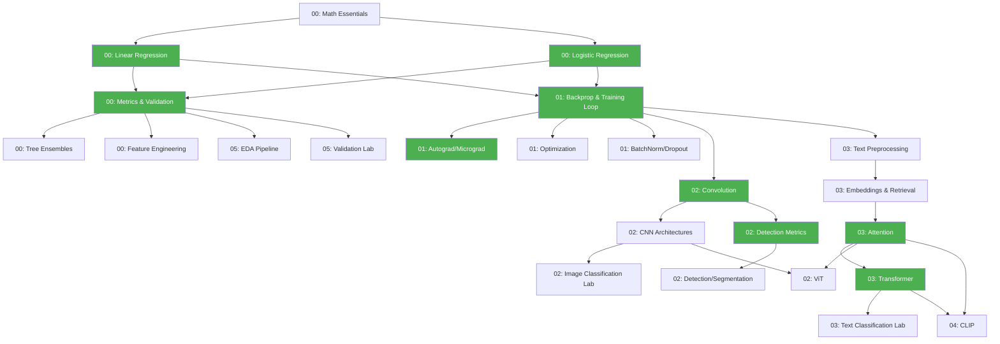

# 📚 Olympic AI From Scratch — Plan Soạn Giáo Trình v3 (Final)

## Mục Tiêu

> Xây dựng giáo trình AI tiếng Việt, open-source và có thể tái lập, giúp người học đi từ nền tảng cần thiết đến năng lực giải bài OlpAI; mỗi chương cung cấp lý thuyết rõ ràng, trực giác, implementation, thí nghiệm, bài tập phân tầng và bài thi liên quan.

### Bốn tiêu chí thành công

| Tiêu chí           | Nghĩa là                                                                                                      |
| ------------------ | ------------------------------------------------------------------------------------------------------------- |
| **Đúng**           | Công thức, code, tài liệu tham khảo và kết quả đều được kiểm chứng                                            |
| **Dễ học**         | Có prerequisite, learning outcomes, worked examples và lộ trình rõ                                            |
| **Giúp thi tốt**   | Có bài tập chuyển giao, đề thật, timed practice và postmortem                                                 |
| **Luyện code tay** | Mỗi chương có code patterns cần nhớ, bài tập code không nhìn tài liệu, và link docs chính thức để tự research |

### Vai trò của tác giả

Tác giả (bạn) vừa học vừa soạn. Nhưng sản phẩm cuối phải phục vụ **người học**, không phải ghi lại quá trình học của tác giả. Mỗi chương phải đọc được bởi sinh viên không quen biết bạn.

---

## Learner Journey — Luồng Mỗi Chương

> [!IMPORTANT]
> Đây là trải nghiệm người đọc khi mở một chương. Không phải mọi chương cần mọi bước — nhưng luồng này là thiết kế chuẩn.

```
┌──────────────────────────────────────────────────────────┐
│  ① Prerequisite Check (3-5 câu tự kiểm tra)             │
│  ② Learning Outcomes (có thể quan sát & đo)             │
│  ③ Concept Map (nối với kiến thức trước/sau)             │
│  ④ Intuition (tại sao cần? giải quyết gì?)              │
│  ⑤ Math & Derivation (derive, không chỉ ghi)            │
│  ⑥ Worked Example (hoàn chỉnh, trước khi giao bài)      │
│  ⑦ From-Scratch Implementation                           │
│  ⑧ Framework Implementation (+ so sánh)                  │
│  ⑨ Controlled Experiments (+ observations)               │
│  ⑩ Common Mistakes / Misconception Box                   │
│  ⑪ Code Notes (patterns cần nhớ + bài luyện code tay)   │
│  ⑫ Exercises by Difficulty (5 tầng)                      │
│  ⑬ Olympiad Transfer                                     │
│  ⑭ References & Docs (link chính thức để tự research)   │
│  ⑮ Mastery Checkpoint                                    │
│  ⑯ Time Estimate (cho người đọc, không phải soạn)       │
└──────────────────────────────────────────────────────────┘
```

---

## 3 Loại Chương

### 📘 Core Chapter

**Dùng cho:** Linear Regression, Logistic Regression, Backpropagation, CNN/Convolution, Attention, Transformer, IoU/NMS

**Luồng đầy đủ ①–⑯. Bắt buộc from-scratch.**

```
topic/
├── README.md              # ①–⑥ + ⑩ + ⑯: Theory, prerequisite, outcomes,
│                          #   concept map, intuition, math, worked example,
│                          #   misconceptions, time estimate
├── 01_from_scratch.ipynb  # ⑦: Zero library imports cho thuật toán đang học
├── 02_framework.ipynb     # ⑧: Library + compare output/speed
├── 03_experiments.ipynb   # ⑨: Controlled experiments + observations + "why"
├── code_notes.md          # ⑪: Code patterns cần nhớ + bài luyện code tay
├── exercises.md           # ⑫: 5 tầng bài tập
├── solutions.md           # Lời giải kiểm chứng được (có thể dùng <details>)
├── olympiad_transfer.md   # ⑬: Chuyển giao sang bài thi (xem mục riêng)
└── references.md          # ⑭: Docs chính thức + tài liệu tự research
```

### 📗 Concept Lesson

**Dùng cho:** Activations, Initialization, Metrics, Augmentation, Tokenization, Regularization, BatchNorm/Dropout, Optimization

**Luồng rút gọn: ①②③④⑩⑪⑫⑭⑮⑯. Không bắt buộc from-scratch.**

```
topic/
├── README.md      # Theory + worked example + misconceptions
├── lab.ipynb      # Demo tương tác, không cần from-scratch
├── code_notes.md  # API patterns cần nhớ (ngắn gọn, dạng cheat sheet)
├── exercises.md   # Bài tập (ít nhất 3 tầng: Understand + Implement + Transfer)
└── references.md  # Docs links + further reading
```

### 📙 Competition Lab

**Dùng cho:** EDA pipeline, Validation, Imbalance handling, Ensembling, Detection workflow, mỗi bài Olympic

**Luồng task-oriented: problem → baseline → improve → postmortem.**

```
topic/
├── README.md        # Problem analysis, approach, metric, validation
├── starter.ipynb    # Bộ khung cho người học tự làm
├── solution.ipynb   # Reference solution (ẩn hoặc tách branch)
├── code_notes.md    # Pipeline patterns cần nhớ cho loại bài này
├── rubric.md        # Tiêu chí chấm: baseline → good → excellent
├── postmortem.md    # Sai ở đâu, học được gì, cải thiện thế nào
└── references.md    # Docs + kaggle discussions + related solutions
```

---

## Bài Tập Phân Tầng (exercises.md)

Mỗi chương có bài tập chia **5 tầng**:

| Tầng | Tên            | Mô tả                                        | Ví dụ (Attention)                                      |
| ---- | -------------- | -------------------------------------------- | ------------------------------------------------------ |
| 1    | **Understand** | Giải thích, derive, dự đoán                  | "Tại sao QKᵀ có variance tăng theo dk?"                |
| 2    | **Implement**  | Hoàn thành hoặc sửa code                     | "Thêm causal mask vào attention function"              |
| 3    | **Experiment** | Thiết kế thí nghiệm, giải thích kết quả      | "Bỏ sqrt(dk), plot softmax output — chuyện gì xảy ra?" |
| 4    | **Transfer**   | Áp dụng vào dữ liệu/bài toán mới             | "Dùng attention cho time series classification"        |
| 5    | **Olympiad**   | Bài thật hoặc mô phỏng có giới hạn thời gian | "Giải IOAI task X trong 90 phút"                       |

> [!TIP]
> Không phải mọi chương cần đủ 5 tầng. Concept Lesson chỉ cần tầng 1-3. Competition Lab chỉ cần tầng 3-5.

---

## Olympiad Transfer — Phần Khiến Giáo Trình Này Khác

> [!IMPORTANT]
> Đây không phải "link tới đề thi". Đây là **năng lực chuyển giao** từ kiến thức sang bài thi.

Mỗi Core Chapter cần một file `olympiad_transfer.md` trả lời:

```markdown
# Olympiad Transfer: [Tên Concept]

## Nhận diện trong đề

Dấu hiệu nào cho thấy nên dùng kiến thức này?

- VD: "Nếu đề nói 'dự đoán nhãn liên tục' → regression"
- VD: "Nếu đề cho ảnh + bbox annotations → detection pipeline"

## Baseline tối thiểu

- Cái gì đơn giản nhất có thể nộp được điểm?
- Mất bao lâu để tạo baseline? (ước lượng phút)

## Metric & Validation phù hợp

- Metric nào đề thường dùng? (accuracy, mAP, F1, RMSE...)
- Validation strategy: k-fold hay hold-out? Stratified?

## Failure modes thường gặp

1. ...
2. ...
3. ...

## Sau baseline, thử gì để tăng điểm?

- Bước 1: ...
- Bước 2: ...
- Bước 3 (nếu còn thời gian): ...

## Phân bổ thời gian trong 6 giờ

| Giai đoạn    | Thời gian                   | Việc |
| ------------ | --------------------------- | ---- |
| 0-30 phút    | Đọc đề, EDA, chọn approach  |
| 30-90 phút   | Baseline pipeline chạy được |
| 90-180 phút  | Improve model/features      |
| 180-300 phút | Experiments + ensemble      |
| 300-360 phút | Viết báo cáo + cleanup code |

## Bài thi thực tế liên quan

| Bài | Nguồn      | Concept chính | Difficulty |
| --- | ---------- | ------------- | ---------- |
| ... | IOAI 2025  | ...           | ⭐⭐⭐     |
| ... | Poland OAI | ...           | ⭐⭐       |
```

---

## Hai Lộ Trình Người Học

### 🟢 Foundation Track

Cho người chưa chắc nền tảng. Đi qua toàn bộ kiến thức từ đầu.

```
Math Essentials → Linear/Logistic Regression → Metrics & Validation
→ Classical ML Overview → DL Core (Training Loop, Backprop)
→ CNN → NLP Fundamentals → Attention/Transformer
→ Competition Skills → Past Problems → Timed Mocks
```

### 🔴 Contest Track

Cho người đã biết cơ bản. Bắt đầu bằng diagnostic test.

```
Diagnostic Test → Validation & Baselines → Gap Remediation
→ CV Task Labs → NLP Task Labs → ML Task Labs
→ Past Olympic Problems → Timed Mocks → Failure Remediation
```

### Đánh dấu trong mỗi module

Mỗi module ghi rõ trong `MODULE_README.md`:

```markdown
## Ai nên học module này?

| Phần                              | Foundation Track | Contest Track                 |
| --------------------------------- | ---------------- | ----------------------------- |
| Math essentials                   | ⭐ Bắt buộc      | ⏭️ Bỏ qua nếu pass diagnostic |
| Linear Regression theory          | ⭐ Bắt buộc      | 📖 Nên đọc lướt               |
| Linear Regression from-scratch    | ⭐ Bắt buộc      | ⏭️ Bỏ qua nếu đã biết         |
| Validation & Leakage              | ⭐ Bắt buộc      | ⭐ Bắt buộc                   |
| Experiments: LR vs regularization | 📖 Nên học       | ⚡ Nâng cao                   |
| Olympiad transfer                 | ⚡ Nâng cao      | ⭐ Bắt buộc                   |
```

---

## Cấu Trúc Repo

```
olympic-ai-from-scratch/
│
├── README.md                        # Vision, cho ai, cách dùng, tracks
├── CURRICULUM_MAP.md                # Bản đồ toàn bộ chương + dependencies
├── PROGRESS.md                      # Trạng thái từng chương (quality gate)
├── CHANGELOG.md                     # Lịch sử phiên bản nội dung
├── CONTRIBUTING.md                  # Hướng dẫn đóng góp
├── LICENSE                          # CC-BY-4.0
├── pyproject.toml                   # Python 3.10+, pinned deps
├── .gitignore
│
├── 00_foundations/
│   ├── MODULE_README.md             # Overview + track guidance
│   ├── math_essentials/             # [Concept] Cheat sheet thực dụng
│   ├── linear_regression/           # [Core] Full 7-file
│   ├── logistic_regression/         # [Core] Full 7-file
│   ├── metrics_and_validation/      # [Core] Full 7-file
│   ├── regularization/              # [Concept] L1/L2/ElasticNet
│   ├── tree_ensembles/              # [Concept] RF, GBM — biết dùng + debug
│   ├── svm_pca_clustering/          # [Concept] Gộp, overview
│   └── feature_engineering/         # [Concept] Leakage, encoding, scaling
│
├── 01_deep_learning/
│   ├── MODULE_README.md
│   ├── autograd_micrograd/          # [Core] Scalar autograd project
│   ├── backprop_training_loop/      # [Core] Manual backprop + PyTorch loop
│   ├── optimization/                # [Concept] SGD, Adam, schedulers
│   ├── batchnorm_dropout/           # [Concept] Khi nào dùng
│   └── debugging_dl/                # [Concept] Gradient check, loss debug
│
├── 02_computer_vision/
│   ├── MODULE_README.md
│   ├── convolution/                 # [Core] From scratch conv2d
│   ├── cnn_architectures/           # [Concept] LeNet → ResNet evolution
│   ├── image_classification/        # [Competition] Pipeline + transfer
│   ├── detection_metrics/           # [Core] IoU, NMS, AP from scratch
│   ├── detection_segmentation/      # [Concept] YOLO/DETR/U-Net overview
│   ├── vit/                         # [Concept] Patch → Attention → Cls
│   └── augmentation/                # [Concept] Strategies
│
├── 03_nlp/
│   ├── MODULE_README.md
│   ├── text_preprocessing/          # [Concept] Tokenization, BoW, TF-IDF
│   ├── embeddings_retrieval/        # [Concept] Word2Vec, dense, BM25
│   ├── attention/                   # [Core] Full from-scratch
│   ├── transformer/                 # [Core] Encoder/Decoder from scratch
│   ├── text_classification/         # [Competition] Pipeline
│   └── rag_anatomy/                 # [Concept] Giải phẫu RAG
│
├── 04_representation/
│   ├── MODULE_README.md
│   ├── contrastive_learning/        # [Concept] InfoNCE, SimCLR
│   ├── clip/                        # [Concept] CV + NLP bridge
│   └── transfer_learning/           # [Concept] Fine-tune patterns
│
├── 05_competition_pipeline/
│   ├── MODULE_README.md
│   ├── eda/                         # [Competition] EDA template + rubric
│   ├── validation/                  # [Competition] K-fold, leakage
│   ├── debugging_ml/                # [Competition] Failure modes
│   ├── imbalance/                   # [Competition] Strategies
│   ├── ensembling/                  # [Competition] Stacking, blending
│   └── experiment_tracking/         # [Concept] Logging experiments
│
├── 06_olympiad_problems/
│   ├── MODULE_README.md
│   ├── diagnostic/                  # Diagnostic test cho Contest Track
│   ├── ioai_2024/                   # [Competition] Per-problem
│   ├── ioai_2025/
│   ├── ioai_2026/
│   ├── olpai_vietnam/
│   ├── poland_oai/
│   ├── mock_contests/
│   └── problem_index.md            # Index theo concept → problem
│
├── 07_team_competition/
│   ├── team_roles.md
│   ├── workflow_6h.md
│   ├── technical_report_template.md
│   ├── notebook_checklist.md
│   └── git_collaboration.md
│
├── templates/
│   ├── tabular_classification.ipynb
│   ├── image_classification.ipynb
│   ├── detection.ipynb
│   ├── segmentation.ipynb
│   ├── text_classification.ipynb
│   ├── retrieval.ipynb
│   └── training_loop.py
│
└── _dev/                            # Không publish, chỉ cho tác giả
    ├── authoring_checklist.md       # Checklist soạn từng chương
    ├── review_log.md                # Ghi chú review/feedback
    └── learner_test_log.md          # Ghi kết quả learner testing
```

---

## Quality Gates — Trạng Thái Chương

Mỗi chương đi qua 6 trạng thái. PROGRESS.md theo dõi theo trạng thái này, không theo "file đã tồn tại".

```
Outlined → Drafted → Technically Reviewed → Learner Tested → Revised → Published
```

| Trạng thái               | Ý nghĩa                                                 | Tiêu chí chuyển sang trạng thái tiếp        |
| ------------------------ | ------------------------------------------------------- | ------------------------------------------- |
| **Outlined**             | Có README skeleton: outcomes, prerequisite, concept map | Luồng learner journey đã rõ                 |
| **Drafted**              | Tất cả file đã viết, notebook chạy được                 | Code đúng, theory coherent                  |
| **Technically Reviewed** | Toán và code đã kiểm chứng                              | Reviewer (hoặc self-review kỹ) confirm      |
| **Learner Tested**       | ≥1 người thuộc target audience đã học thử               | Feedback ghi vào `_dev/learner_test_log.md` |
| **Revised**              | Sửa theo feedback, misconceptions đã thêm               | Thời gian học thực tế khớp ước tính         |
| **Published**            | Sẵn sàng public                                         | Pass tất cả quality gate checks             |

### Quality Gate Checks (cho trạng thái Published)

- [ ] Toán và code đã kiểm chứng (self hoặc peer review)
- [ ] Notebook chạy lại từ môi trường sạch (Colab mới hoặc fresh venv)
- [ ] Có nguồn cho dữ liệu, hình ảnh và phát biểu quan trọng
- [ ] Learning outcomes khớp với exercises
- [ ] Có ít nhất một bài tập Transfer (tầng 4)
- [ ] ≥1 người thuộc target audience đã học thử
- [ ] Misconceptions phổ biến đã được ghi
- [ ] Thời gian học thực tế không lệch >50% so với ước tính

### PROGRESS.md Format

```markdown
## Module 00: Foundations

| Chương              | Loại    | Track       | Status   | Reviewer | Learner Test | Notes |
| ------------------- | ------- | ----------- | -------- | -------- | ------------ | ----- |
| math_essentials     | Concept | F: ⭐ C: ⏭️ | Drafted  | —        | —            |       |
| linear_regression   | Core    | F: ⭐ C: 📖 | Outlined | —        | —            |       |
| logistic_regression | Core    | F: ⭐ C: 📖 | —        | —        | —            |       |
| metrics_validation  | Core    | F: ⭐ C: ⭐ | —        | —        | —            |       |

| ...
```

---

## Phiên Bản Phát Hành

| Version                      | Thời điểm     | Nội dung                                                                                                |
| ---------------------------- | ------------- | ------------------------------------------------------------------------------------------------------- |
| **v0.1 — OlpAI Core**        | Trước 01/11   | Curriculum map, Contest Track, ~8 Core chapters drafted, competition pipeline, templates, problem index |
| **v0.2 — Post-Regional**     | 02/11 → 30/11 | Bổ sung Foundation Track, from-scratch sâu hơn, postmortems từ vòng khu vực                             |
| **v0.5 — Pre-Finals**        | 01/12 → 07/12 | Solutions cho exercises, hình minh họa, learner testing batch 1                                         |
| **v1.0 — Community Release** | 01/2027+      | Tất cả chương Published, MkDocs site, blog post, CONTRIBUTING.md active                                 |

> [!NOTE]
> Một giáo trình tốt bắt buộc phải qua vòng feedback. v1.0 chỉ đạt được khi có người học thực tế đã dùng và góp ý.

---

## README.md Template Cho Core Chapter

````markdown
# [Tên Topic]

> **Thời gian học ước tính:** X giờ (theory: Xh, code: Xh, exercises: Xh)
> **Loại:** Core Chapter
> **Track:** Foundation ⭐ | Contest 📖

## Prerequisite Check

Trước khi bắt đầu, bạn cần trả lời được:

1. [Câu kiểm tra kiến thức nền 1]
2. [Câu kiểm tra kiến thức nền 2]
3. [Câu kiểm tra kiến thức nền 3]

Nếu chưa trả lời được → quay lại [chương X](link).

## Learning Outcomes

Sau chương này, bạn sẽ có thể:

- [ ] [Outcome 1 — quan sát được, đo được]
- [ ] [Outcome 2]
- [ ] [Outcome 3]

## Concept Map

```text
[Chương trước] ──→ [CHƯƠNG NÀY] ──→ [Chương sau]
                        │
                        ├── dùng trong [Detection]
                        └── nền tảng cho [Transformer]
```
````

## 1. Intuition — Tại Sao Cần?

[Giải thích vấn đề mà concept này giải quyết. Không dùng thuật ngữ chưa định nghĩa.]

## 2. Math & Derivation

[Derive, không chỉ ghi. Mỗi bước giải thích "tại sao bước này".]

## 3. Worked Example

[Ví dụ hoàn chỉnh, tính tay được, trước khi giao bài.]

## 4. Shape Analysis

[Kích thước tensor đầu vào/đầu ra, ý nghĩa mỗi chiều.]

## 5. Complexity

[Time/space complexity. Giới hạn thực tế.]

## 6. Common Mistakes & Misconceptions

> ❌ **Sai:** [Cách hiểu sai phổ biến]
> ✅ **Đúng:** [Cách hiểu đúng + tại sao]

> ❌ **Sai:** ...
> ✅ **Đúng:** ...

## 7. Connections

[Concept này nối với những gì? Tại sao quan trọng cho Olympic?]

## References & Docs (Tự Research)

### Official Documentation

| Thư viện                                         | Link                          | Đọc phần nào cho chương này |
| ------------------------------------------------ | ----------------------------- | --------------------------- |
| [NumPy](https://numpy.org/doc/)                  | `numpy.ndarray`, broadcasting | Shape operations            |
| [PyTorch](https://pytorch.org/docs/)             | `nn.Module`, `autograd`       | Training loop               |
| [scikit-learn](https://scikit-learn.org/stable/) | `model_selection`, `metrics`  | Validation                  |

### Papers & Textbooks

- [Paper/Book 1](link) — đọc section X
- [Paper/Book 2](link) — đọc section Y

### Video & Courses

- [Video 1](link) — giải thích trực giác tốt nhất
- [Video 2](link) — deep dive toán

### Community

- [StackOverflow tag](link)
- [Kaggle discussion](link)

`````

---

## code_notes.md Template — Luyện Code Tay

> [!IMPORTANT]
> File này là **cheat sheet để học thuộc**. Mục tiêu: nhìn tên pattern → code ra được mà không mở docs.

````markdown
# Code Notes: [Tên Topic]

## 🔑 Core Patterns (Phải nhớ)

### Pattern 1: [Tên — vd: "Gradient Descent Update"]

```python
# Mô tả: [1 dòng nói pattern này làm gì]
# Khi nào dùng: [tình huống cụ thể]

def gradient_descent(X, y, lr=0.01, epochs=100):
    w = np.zeros(X.shape[1])
    b = 0.0
    for _ in range(epochs):
        y_pred = X @ w + b
        dw = (2 / len(y)) * X.T @ (y_pred - y)
        db = (2 / len(y)) * np.sum(y_pred - y)
        w -= lr * dw
        b -= lr * db
    return w, b
`````

**Ghi nhớ:** `dw = X.T @ error`, `db = sum(error)`, update = `param -= lr * grad`

### Pattern 2: [Tên — vd: "PyTorch Training Loop"]

```python
model.train()
for epoch in range(epochs):
    for X_batch, y_batch in dataloader:
        optimizer.zero_grad()
        output = model(X_batch)
        loss = criterion(output, y_batch)
        loss.backward()
        optimizer.step()
```

**Ghi nhớ:** `zero_grad → forward → loss → backward → step`

## 📋 API Cheat Sheet

| Việc cần làm   | Code                                               | Docs                                                                                         |
| -------------- | -------------------------------------------------- | -------------------------------------------------------------------------------------------- |
| Tạo DataLoader | `DataLoader(dataset, batch_size=32, shuffle=True)` | [link](https://pytorch.org/docs/stable/data.html)                                            |
| K-Fold split   | `KFold(n_splits=5, shuffle=True, random_state=42)` | [link](https://scikit-learn.org/stable/modules/generated/sklearn.model_selection.KFold.html) |
| Save model     | `torch.save(model.state_dict(), 'model.pth')`      | [link](https://pytorch.org/tutorials/beginner/saving_loading_models.html)                    |

## 🏋️ Bài Luyện Code Tay

**Quy tắc:** Đóng tất cả tài liệu. Mở notebook trống. Hẹn giờ.

| #   | Bài                                         | Thời gian | Hint (chỉ xem khi bí)                     |
| --- | ------------------------------------------- | --------- | ----------------------------------------- |
| 1   | Code gradient descent cho linear regression | 15 phút   | `dw = X.T @ error / n`                    |
| 2   | Code training loop PyTorch (không nhìn)     | 10 phút   | `zero → forward → loss → backward → step` |
| 3   | Code k-fold cross validation                | 20 phút   | `KFold` hoặc manual index splitting       |
| 4   | Code [concept khó nhất chương này]          | 25 phút   | [hint ngắn]                               |

## 🧠 Flashcards (Hỏi → Trả lời)

| Hỏi                                       | Trả lời                                    |
| ----------------------------------------- | ------------------------------------------ |
| Learning rate quá lớn → chuyện gì xảy ra? | Loss oscillate hoặc diverge                |
| Tại sao chia cho n trong MSE gradient?    | Để gradient không phụ thuộc batch size     |
| `model.eval()` làm gì?                    | Tắt dropout + BatchNorm dùng running stats |

`````

---

## references.md Template — Tự Research

````markdown
# References: [Tên Topic]

## 📚 Official Documentation

| Thư viện | Đọc gì | Link trực tiếp |
|----------|--------|---------------|
| NumPy | Broadcasting rules | [numpy.org/doc/.../broadcasting](https://numpy.org/doc/stable/user/basics.broadcasting.html) |
| PyTorch | `nn.Linear`, `autograd` | [pytorch.org/docs/.../nn](https://pytorch.org/docs/stable/nn.html) |
| scikit-learn | `train_test_split`, `cross_val_score` | [scikit-learn.org/.../cross_validation](https://scikit-learn.org/stable/modules/cross_validation.html) |

## 📖 Textbook Chapters

| Sách | Chương | Tại sao đọc |
|------|--------|-------------|
| D2L (d2l.ai) | Ch.3 Linear Regression | Derivation chuẩn + code |
| Bishop PRML | Ch.3.1 | Bayesian perspective |

## 🎥 Video Giải Thích Tốt Nhất

| Video | Tác giả | Nên xem khi |
|-------|---------|-------------|
| [Neural Networks](https://www.youtube.com/...) | 3Blue1Brown | Cần trực giác hình học |
| [Backprop](https://www.youtube.com/...) | Karpathy | Cần hiểu code-level |

## 📝 Blog Posts & Tutorials

- [Tên bài](link) — tóm tắt 1 dòng
- [Tên bài](link) — tóm tắt 1 dòng

## 🏆 Competition Resources

- [Kaggle notebook](link) — winning solution cho bài tương tự
- [IOAI discussion](link) — nếu có
`````

---

## Timeline v0.1 — OlpAI Core (10 tuần)

> **Nguyên tắc:** Mỗi tuần có ít nhất 1 timed task. Competition pipeline active từ tuần 1.

### Tuần 0 — Setup + Diagnostic (24-25/08)

| Việc                                                      | Output                              |
| --------------------------------------------------------- | ----------------------------------- |
| Scaffold repo + curriculum map                            | Repo structure, `CURRICULUM_MAP.md` |
| Diagnostic test: làm 2 bài IOAI baseline (3h có giới hạn) | `06_olympiad_problems/diagnostic/`  |
| Gap analysis → quyết định topic nào ưu tiên               | Adjusted priority                   |

### Tuần 1 — ML Core + Pipeline (25/08 → 31/08)

| Focus       | Chapters                              | Status target |
| ----------- | ------------------------------------- | ------------- |
| Core        | `linear_regression/`                  | Drafted       |
| Core        | `logistic_regression/`                | Drafted       |
| Core        | `metrics_and_validation/`             | Outlined      |
| Competition | `05_competition_pipeline/eda/`        | Drafted       |
| Competition | `05_competition_pipeline/validation/` | Drafted       |
| Timed task  | 1 tabular problem (2-3h)              | Postmortem    |

### Tuần 2 — Classical ML Applied (01/09 → 07/09)

| Focus       | Chapters                   | Status target |
| ----------- | -------------------------- | ------------- |
| Concept     | `regularization/`          | Drafted       |
| Concept     | `tree_ensembles/`          | Drafted       |
| Concept     | `svm_pca_clustering/`      | Outlined      |
| Concept     | `feature_engineering/`     | Drafted       |
| Competition | Tabular template v1        | Working       |
| Timed task  | 1 tabular competition (3h) | Postmortem    |

### Tuần 3 — Neural Networks (08/09 → 14/09)

| Focus      | Chapters                   | Status target |
| ---------- | -------------------------- | ------------- |
| Core       | `autograd_micrograd/`      | Drafted       |
| Core       | `backprop_training_loop/`  | Drafted       |
| Concept    | `optimization/`            | Outlined      |
| Concept    | `batchnorm_dropout/`       | Outlined      |
| Milestone  | Overfit MNIST subset       | ✅            |
| Timed task | 1 basic image problem (3h) | Postmortem    |

### Tuần 4 — CNN + Image Classification (15/09 → 21/09)

| Focus       | Chapters                                  | Status target |
| ----------- | ----------------------------------------- | ------------- |
| Core        | `convolution/`                            | Drafted       |
| Concept     | `cnn_architectures/`                      | Drafted       |
| Concept     | `augmentation/`                           | Outlined      |
| Competition | `image_classification/`                   | Drafted       |
| Template    | `templates/image_classification.ipynb` v1 | Working       |
| Timed task  | 1 CV competition (3h)                     | Postmortem    |

### Tuần 5 — Detection + Segmentation (22/09 → 28/09)

| Focus      | Chapters                            | Status target |
| ---------- | ----------------------------------- | ------------- |
| Core       | `detection_metrics/` (IoU, NMS, AP) | Drafted       |
| Concept    | `detection_segmentation/`           | Drafted       |
| Concept    | `vit/`                              | Outlined      |
| Templates  | Detection + Segmentation            | Working       |
| Timed task | 1 IOAI CV problem (3h)              | Postmortem    |
| Timed task | 1 IOAI problem (khác domain)        | Postmortem    |

### Tuần 6 — NLP Fundamentals (29/09 → 05/10)

| Focus       | Chapters                                    | Status target |
| ----------- | ------------------------------------------- | ------------- |
| Concept     | `text_preprocessing/`                       | Drafted       |
| Concept     | `embeddings_retrieval/`                     | Drafted       |
| Competition | `text_classification/`                      | Drafted       |
| Team        | `07_team_competition/` (roles, workflow 6h) | Drafted       |
| Templates   | Text classification + Retrieval             | Working       |
| Timed task  | 1 NLP problem (3h)                          | Postmortem    |

### Tuần 7 — Transformer (06/10 → 12/10)

| Focus        | Chapters                                 | Status target      |
| ------------ | ---------------------------------------- | ------------------ |
| Core         | `attention/`                             | Drafted            |
| Core         | `transformer/`                           | Drafted            |
| Concept      | `rag_anatomy/`                           | Outlined (nếu kịp) |
| Mini project | Tiny language model hoặc text classifier | Working            |
| Timed task   | 1 NLP/multimodal problem (3h)            | Postmortem         |

### Tuần 8 — Gap-Fill + Mock #1 (13/10 → 19/10)

| Focus       | Việc                                                   | Status target |
| ----------- | ------------------------------------------------------ | ------------- |
| Concept     | `contrastive_learning/`, `clip/`, `transfer_learning/` | Outlined      |
| Gap-fill    | Topic yếu từ timed tasks                               | Depends       |
| **Mock #1** | 6 giờ sát format OlpAI (với đội)                       | Postmortem    |

### Tuần 9 — Problem Grinding (20/10 → 26/10)

| Ngày  | Việc                                      |
| ----- | ----------------------------------------- |
| T1-T2 | Giải 2 bài IOAI (2024/2025) + postmortems |
| T3    | Giải 1 bài IOAI 2026 At-Home + postmortem |
| T4    | **Mock #2** (6 giờ)                       |
| T5    | Postmortem + fix pipelines                |
| T6-CN | 1 bài Poland OAI + pattern analysis       |

### Tuần 10 — Contest Mode (27/10 → 01/11)

| Ngày      | Việc                                  |
| --------- | ------------------------------------- |
| T1        | **Mock #3** (6 giờ, với đội nếu có)   |
| T2        | Postmortem + final template fixes     |
| T3        | Review top 5 failure patterns lặp lại |
| T4        | Light review mastery gates            |
| T5        | Tapering — không học mới              |
| **01/11** | 🏆 **OlpAI Vòng Khu Vực**             |

---

## Mastery Gates (Cho Core Chapters)

Mỗi Core Chapter cần pass ít nhất 4/6:

| Gate                | Cách verify                                |
| ------------------- | ------------------------------------------ |
| 🗣️ **Explain**      | Đóng tài liệu, giải thích 5-10 phút        |
| ✍️ **Derive**       | Viết công thức chính trên giấy trắng       |
| 💻 **Re-implement** | Code lại từ notebook trống                 |
| 🔮 **Predict**      | Dự đoán kết quả experiment trước khi chạy  |
| 🐛 **Diagnose**     | Tìm bug trong implementation cài lỗi       |
| 🆕 **Apply**        | Giải 1 bài chưa từng thấy dùng concept này |

---

## Quỹ Thời Gian Kiểm Chứng

### Ước tính thời gian soạn theo loại

| Loại            | Thời gian soạn | Thời gian học (cho reader) |
| --------------- | -------------- | -------------------------- |
| Core Chapter    | 10-15h         | 6-10h                      |
| Concept Lesson  | 3-5h           | 2-3h                       |
| Competition Lab | 5-8h           | 3-5h                       |

### Budget 10 tuần

| Loại                    | Số lượng v0.1                                                                    | Tổng giờ soạn |
| ----------------------- | -------------------------------------------------------------------------------- | ------------- |
| Core Chapter            | 8 (LinReg, LogReg, Validation, Autograd, Backprop, Conv, Attention, Transformer) | 80-120h       |
| Concept Lesson          | ~12                                                                              | 36-60h        |
| Competition Lab         | ~6 + 5 problems + 3 mocks                                                        | 40-60h        |
| Setup, review, gap-fill | —                                                                                | 20-30h        |
| **Tổng**                |                                                                                  | **~180-270h** |

**20-27h/tuần ≈ 3-4h/ngày trung bình.** Ngày bận trường 2h, ngày nghỉ 5-6h. Khả thi nhưng đòi hỏi kỷ luật.

### Cắt giảm nếu thiếu thời gian (theo thứ tự ưu tiên bỏ)

1. Module 04 (Representation) → đẩy sang v0.2
2. `rag_anatomy/` → đẩy sang v0.2
3. `svm_pca_clustering/` → outline only
4. Giảm Core Chapter xuống 6 (bỏ Autograd, gộp Backprop+TrainingLoop)
5. Solutions.md → đẩy sang v0.5

---

## Commit Convention

```

feat(core): draft linear regression chapter
feat(concept): draft augmentation lesson
feat(comp): create image classification competition lab
feat(pipeline): build EDA template v1
solve(ioai25): baseline for task 2
postmortem(mock1): week 8 mock contest analysis
outline(transformer): skeleton with outcomes and prerequisites
review(linreg): fix gradient derivation error
template(cv): update image classification pipeline
release(v0.1): tag pre-competition release

```

---

## Tài Liệu Tham Khảo Cho Từng Module

| Module            | Primary                        | Secondary               | Problem Bank    |
| ----------------- | ------------------------------ | ----------------------- | --------------- |
| 00 Foundations    | D2L ch.2,18 + ML-From-Scratch  | scikit-learn docs       | Kaggle tabular  |
| 01 Deep Learning  | Karpathy nn-zero-to-hero       | D2L ch.4-8              | —               |
| 02 CV             | D2L ch.7-8,13                  | OlimpiadaAI szkolenia   | IOAI CV tasks   |
| 03 NLP            | D2L ch.9-10,15                 | OlimpiadaAI szkolenia   | IOAI NLP tasks  |
| 04 Representation | Original papers (CLIP, SimCLR) | D2L ch.15               | IOAI multimodal |
| 05 Competition    | Kaggle winning solutions       | AI-Olympiad repo        | —               |
| 06 Problems       | IOAI 2024/25/26 official repos | Poland OAI, AI-Olympiad | —               |

---

## Curriculum Map (Dependency Graph)



<small>🟢 = Core Chapter (from-scratch bắt buộc)</small>

---

## Trạng Thái Hiện Tại

- **Đội thi:** Đã có đội. Module 07 (Team Competition) đã được dời lên Tuần 6 để team có thời gian làm quen workflow trước kỳ Mock #1 (Tuần 8).
- **Tiến độ:** Tạm dừng ở bước chốt plan v3. Chưa scaffold code. Có thể bắt đầu tạo repo và cấu trúc file ở phiên làm việc tiếp theo khi bạn sẵn sàng.
